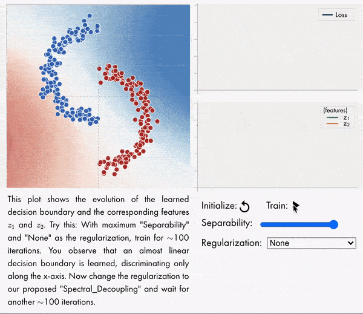

# Gradient_Starvation

The provided code for each figure or table is standalone and does not depend on other folders. This has resulted in code repetition but facilitates reusability. To run the code, simply run the main `.sh` or `.py` file.

### Requirements:
- python 3.6.8
- matplotlib 3.0.3
- numpy 1.16.2
- pandas 0.24.2
- pillow 5.4.1
- pytorch 1.1.0
- pytorch_transformers 1.2.0
- torchvision 0.5.0a0+19315e3
- tqdm 4.32.2
- [nngeometry](https://github.com/tfjgeorge/nngeometry)
